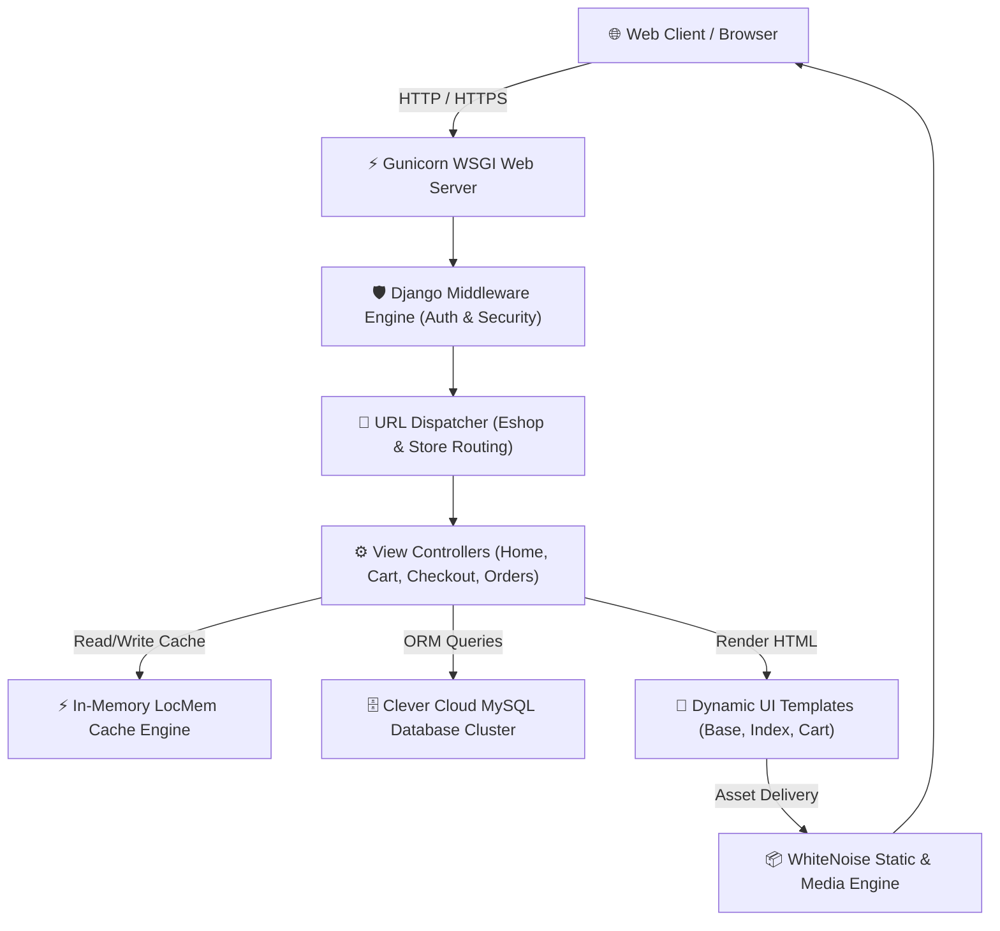
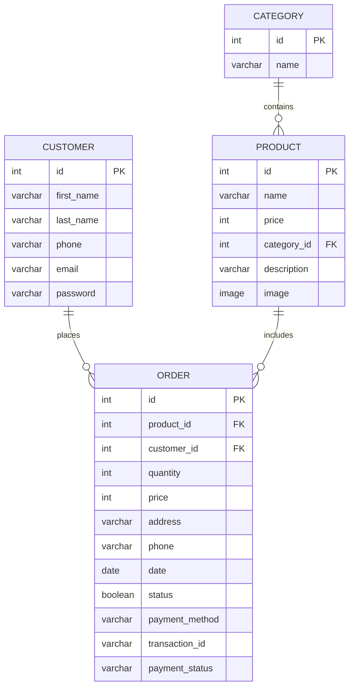
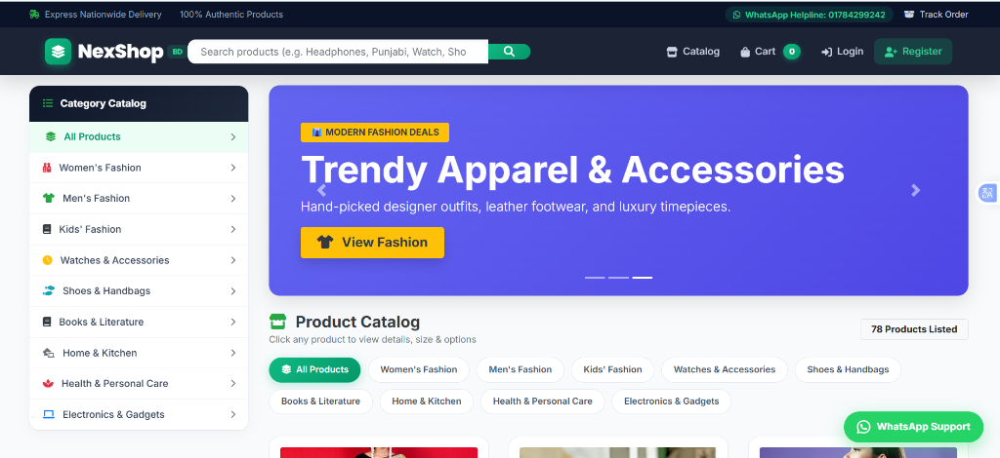
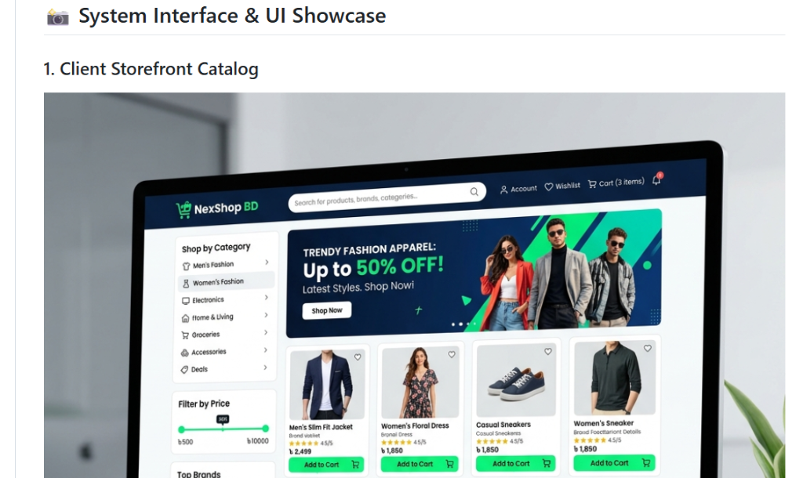

# 🛒 NexShop-BD — Full-Stack Enterprise E-Commerce Platform

[](https://python.org)
[](https://djangoproject.com)
[](https://www.clever-cloud.com)
[](https://render.com)
[](LICENSE)

An enterprise-grade, full-stack Bangladeshi E-Commerce web platform engineered with **Django (MVC Framework)**, **MySQL Database Cluster**, **LocMem In-Memory Caching**, and **WhiteNoise Asset Compression**. Designed for high throughput, session persistence, location-based delivery charge calculation, and streamlined administrative order verification.

---

## 🌐 Production Web Services

| Environment | Hosting Platform | Live URL | Status |
| :--- | :--- | :--- | :---: |
| **Storefront Web Service** | Render Cloud Platform | 🔗 [https://nexshop-bd.onrender.com](https://nexshop-bd.onrender.com) | `Active 🟢` |
| **Admin Control Center** | Django Portal Engine | 🔒 [https://nexshop-bd.onrender.com/admin/](https://nexshop-bd.onrender.com/admin/) | `Active 🟢` |

---

## 🏛️ Academic Metadata & Course Information

- **Institution:** Daffodil International University (DIU)
- **Department:** Department of Computer Science & Engineering (CSE)
- **Course Name:** Database Management System Lab
- **Course Code:** CSE312
- **Course Instructor:** **Dipro Paul** ([@dip-ro](https://github.com/dip-ro))

---

## 👥 Engineering Team & Contributor Matrix

| Contributor Avatar | Developer Name | Student ID | GitHub Profile | Engineering Responsibilities |
| :---: | :--- | :---: | :---: | :--- |
|  | **Ali Jahan Riashad** | `242-15-846` | [@alijahan365](https://github.com/alijahan365) | **Team Lead** / UI Architecture, Templatetags, Admin Portal, CI/CD Deployment |
|  | **Lauhe Mafuj Udoy** | `242-15-395` | [@udoy395](https://github.com/udoy395) | Core Developer (Cart Logic, Distance Checkout & Orders System) |
|  | **Arafat Islam** | `242-15-388` | [@arafatai388](https://github.com/arafatai388) | Core Developer (Category & Product Catalog Models, App Routing) |
|  | **Eamin Hossien** | `242-15-823` | [@eamin3377](https://github.com/eamin3377) | Core Developer (User Authentication, Customer Profile Module) |

---

## 📐 System Architecture & Data Flow

### 1. High-Level Architecture Diagram


### 2. Relational Database Entity-Relationship (ER) Schema


---

## ✨ Core System Features & Technical Design

### 🛍️ Client Storefront
- **Dynamic Category & Search Navigation:** Fast product discovery backed by SQL indexing and category filtering.
- **Cart & Session Persistence:** 30-day persistent cookie session engine retaining cart states across visits.
- **Interactive Product Quick-View:** Dynamic modal rendering product details, stock state, sizes, and pricing.
- **Distance & Location Delivery:** Real-time distance-based shipping fee calculation during checkout.

### 🛡️ Administrative Dashboard
- **Sleek Emoji-Free Custom Admin:** Tailored Django Admin panel designed for high-efficiency business management.
- **Payment Verification Workflow:** One-click badge action (`Pending` ➔ `Verified & Approved`).
- **Order Delivery Tracking:** Processing pipeline controller (`Processing` ➔ `Shipped` ➔ `Delivered`).
- **CLI Superuser Automation:** Custom management command (`python manage.py create_admin`) for zero-touch cloud initialization.

---

## 📸 System Interface & UI Showcase

### 1. Client Storefront Catalog

> *Interactive hero banners, dynamic category navigation sidebar, product grid with BDT pricing, and instant cart control system.*

### 2. Administrative Payment Verification & Order Dispatch Workflow

> *Custom Django administrative control center featuring one-click mobile payment verification (bKash/Nagad/Rocket badges) and real-time delivery dispatch status management.*

---

## 📁 Directory & Workspace Layout

```text
NexShop-BD/
├── .github/                  # GitHub Workflows & CI Configs
├── Eshop/                    # Core Django Project Configurations
│   ├── settings.py           # Database (MySQL & DATABASE_URL) & Cache Settings
│   ├── urls.py               # Global URL Routing & Media Handler
│   └── wsgi.py               # Production WSGI Application Handler
├── store/                    # Main E-Commerce Application Package
│   ├── management/           # CLI Commands (python manage.py create_admin)
│   ├── middlewares/          # Custom Authentication Middlewares (auth.py)
│   ├── migrations/           # Database Migration History Files (0001 - 0012)
│   ├── models/               # Relational Database Models (Product, Order, Customer, Category)
│   ├── templates/            # HTML Views (base.html, index.html, cart.html, etc.)
│   ├── templatetags/         # Custom Template Filters (currency, cart helpers)
│   ├── views/                # MVC Controllers (home.py, cart.py, checkout.py, etc.)
│   ├── admin.py              # Custom Admin Dashboard Configuration
│   └── urls.py               # App Level Route Declarations
├── media/                    # Media Assets & Product Images Directory
├── initial_data.json         # Database Fixtures Backup
├── seed_data.sql             # MySQL Seed Script
├── .env.example              # Environment Configuration Template
├── manage.py                 # Django Administrative Script
├── requirements.txt          # Production Dependency Requirements
└── README.md                 # Technical Documentation
```

---

## 🚀 Local Installation & Execution Guide

### Prerequisites
- Python `3.10.x` installed
- MySQL Server running locally or via remote database service

```bash
# 1. Clone the repository
git clone https://github.com/alijahan365/NexShop-BD.git
cd NexShop-BD

# 2. Initialize Virtual Environment
python -m venv venv
venv\Scripts\activate

# 3. Install Required Dependencies
pip install -r requirements.txt

# 4. Configure Environment Variables
# Copy .env.example to .env and input database credentials

# 5. Execute Database Migrations
python manage.py migrate

# 6. Launch Development Server
python manage.py runserver
```
Visit `http://127.0.0.1:8000/` to test the local deployment.

---

## 📜 License Information

This project is licensed under the terms of the **MIT License** — see the [LICENSE](LICENSE) file for complete details.

```text
Copyright (c) 2026 ALI JAHAN, Arafat Islam, Lauhe Mafuj, Eamin Hossien
```
